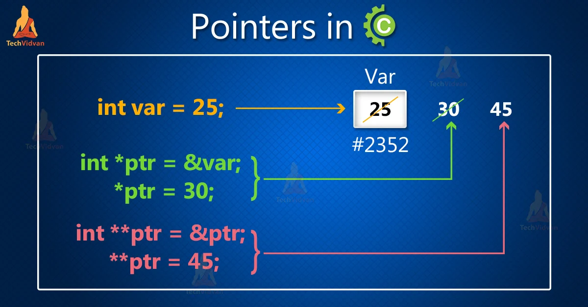
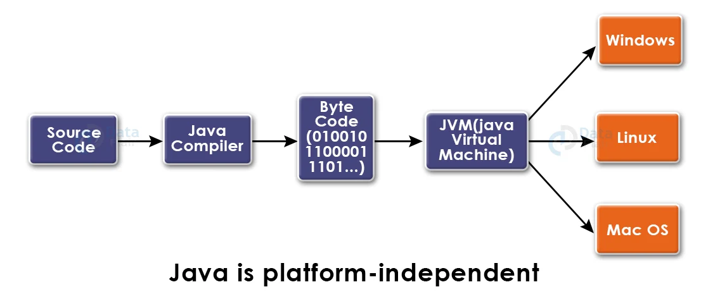
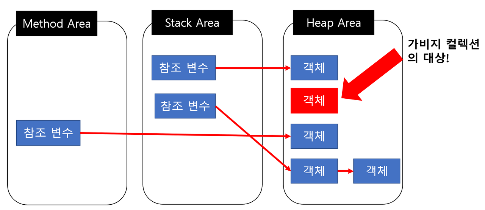
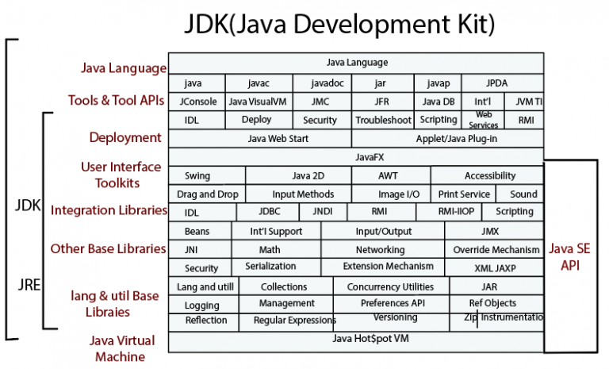
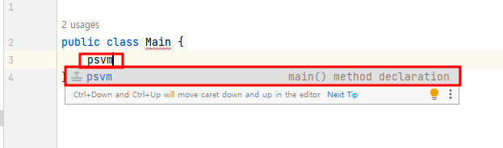
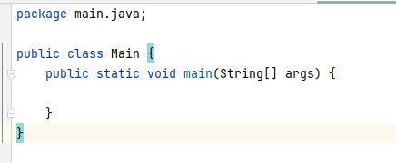
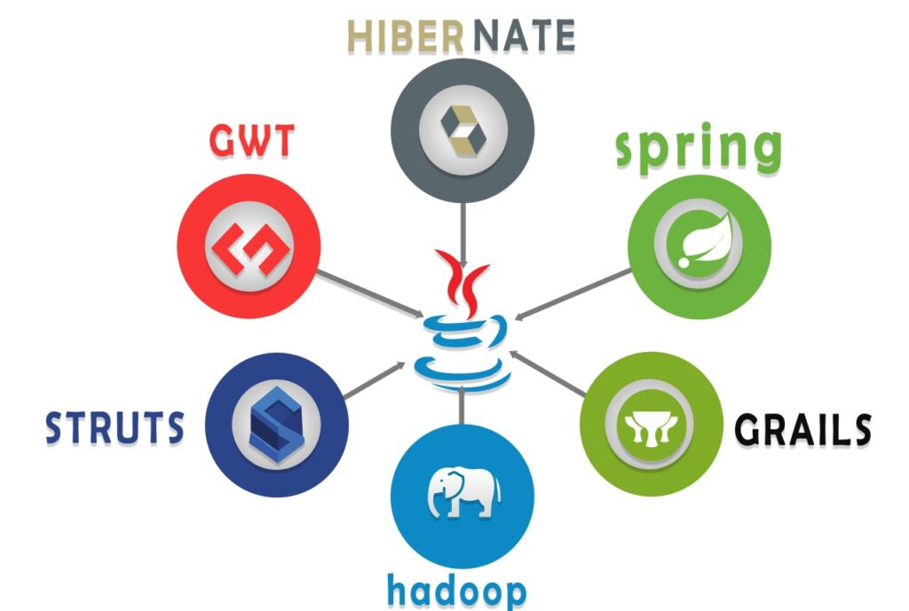
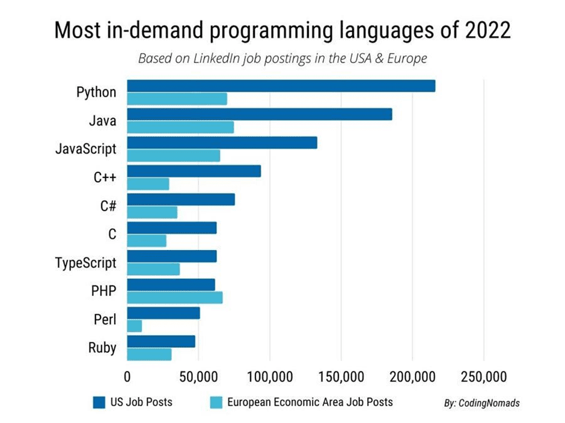

# 왜 자바를 쓰는가

by ncookie

---

# 목차

* 자바의 장점
* 자바의 단점
* 그럼에도 왜 자바를 쓰는가

---

# 자바의 장점

---

# Simple

- 포인터를 사용하지 않음


---

# 플랫폼 독립적

## JVM(Java Virtual Machine), 자바 가상 머신
- 자바가 운영체제에 구애받지 않고 독립적으로 작동 가능
- Garbage Collection을 포함하고 있음
- JVM이 지원하는 OS가 설치되어 있다면 어떤 디바이스에서도 실행 가능

--- 



---

# GB(Garbage Collection)

## 메모리 관리 방법

### C++
```c++
int* dynamicArray = new int[10];
// 사용 후
delete[] dynamicArray;
```

### C
```c
int* dynamicValue = (int*)malloc(sizeof(int));
// 사용 후
free(dynamicValue);
```

---

## 개발자가 직접 메모리를 관리한다면?

- 실력 좋은 개발자가 개발할 경우, 메모리 최적화 가능 -> 성능 향상
- 초보가 한다면? -> 메모리 누수, 성능 저하 등의 문제 발생!

---

## 이 자바는 무료로 해줍니다 



---

# 방대한 표준 라이브러리

- JDK(Java Development Kit) 설치 시 포괄적인 표준 라이브러리 제공
- 입력/출력 작업, 네트워킹, 데이터베이스 연결 및 GUI 개발 등을 포함
  -> 개발을 단순화

---



---

# 자바의 단점

---

# 장황한 코드

극단적인 예시로, 간단한 코드를 짜더라도 boilerplate 코드가 많음

## 파이썬
```python
print("Hello World!")
```

## 자바
```java
package com;
public class Main {
    public static void main(String[] args) {
        System.out.println("Hello Wolrd!");
    }
}
```

---

그래도 요즘 IDE 성능 좋아져서 자동완성 덕분에 편함
~~(JetBrains는 신이고 IntelliJ는 무적이다)~~




---

# 메모리 소비

## Garbage Collection의 한계
- 자바에서는 메모리 관리를 JVM의 GB에서 해준다.
- 근데 GB <- 얘가 성능이 구림 (요즘은 많이 좋아짐)
- 편리하지만 개발자 실력에 비해 성능 향상 효율이 떨어짐
  - 사용하지 않는 메모리 영역이 있어도 GB가 지우기 전까지는 할 수 있는게 없음

---

- GB가 실행되는 동안은 JVM의 동작이 일시적으로 멈추기 때문에 자주 호출하면 또 성능이 떨어짐
- 성능이 중요한 프로그램에서는 잘 쓰이지 않음 (C/C++이 절대 안 죽는 이유)

---

# 성능 오버헤드

## JVM
- 또 얘가 문제다. 혼자 장단점 다 가지고 있음
- 아주 간단한 기능을 수행하는 프로그램이더라도 무조건 JVM을 거쳐 실행되야 하기 때문에 불필요한 리소스를 많이 잡아먹음

---

# 하드웨어 수준 작업 부족

자바는 **JVM**을 사용하기 때문에 저수준의 하드웨어를 제어를 제한함
-> 하드웨어를 최적화하는게 중요한 임베디드에서는 별로...

---

# 그럼에도 자바를 쓰는 이유

---

# 활성화된 커뮤니티와 생태계

- 오래 전부터 사용되던 언어이기 때문에 관련 자료가 많다.
- 대규모 커뮤니티와 활발한 생태계를 가지고 있다. 다양한 문제에 대한 해결책, 학습 자료, 오픈 소스 프로젝트 등을 찾거나 공유할 수 있는 풍부한 자원을 제공한다.

---

# 풍부한 라이브러리와 프레임워크



---

# 꾸준히 쓰임



---

# 끝